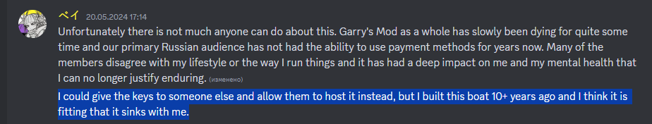

# Flood-2.0

Workshop: http://steamcommunity.com/sharedfiles/filedetails/?id=474900236

Credits:
1) [MS] Mythic (Mythikos) - for development of serverside and clientside code.  
2) Freezebug - for development of serverside code.   
3) Nebual - for the development of NADMOD and permission to use it in our gamemode.  

# Devinity

Credits:
1) Donkie - former co-owner
2) Bayrock - owner now (co-owner in the past)
3) counter - dev or who (I don't remember)
etc.

No, I don't think so

Piracy and only piracy!